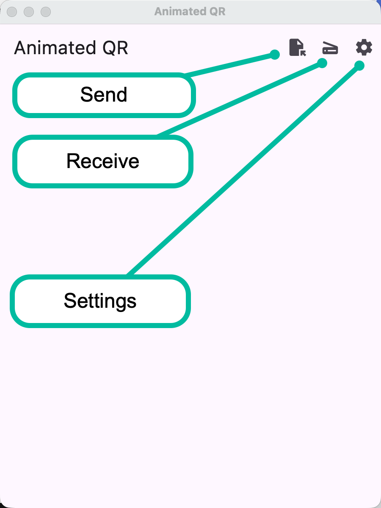

AnimatedQR is a simple app that lets you share (small) files between devices via
animated QR codes. It should be fairly straightforward to use:
1. [open][1] the file on the sender device and it will generate a series of QR codes.
2. [scan][2] these codes using the same app on the receiving device and once enough
   QR codes are received, it will offer to save the file.

::: tip
AnimatedQR is designed to work in environments where network communication needs
to be avoided. It does not use WIFI, Bluetooth, NFC, or Mobile Data.
:::

## Troubleshooting
There are many [settings][3] to customize that customizes the type of QR codes. If
you have trouble getting the QR codes recognized, try tweaking these settings.

[1]: ./create.md
[2]: ./scan.md
[3]: ./settings.md
