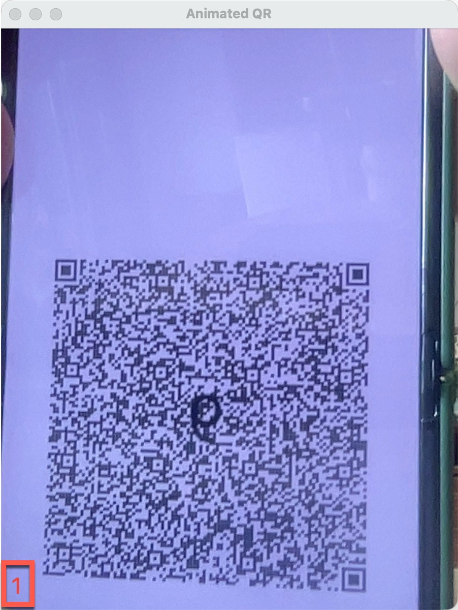

The number at the bottom left corner of the scanner is the number of images succesfully decoded. If the number does not increase when the QR code changes, try to move the camera closer. If it does not work, try adjusting the [Settings](./settings.md)
