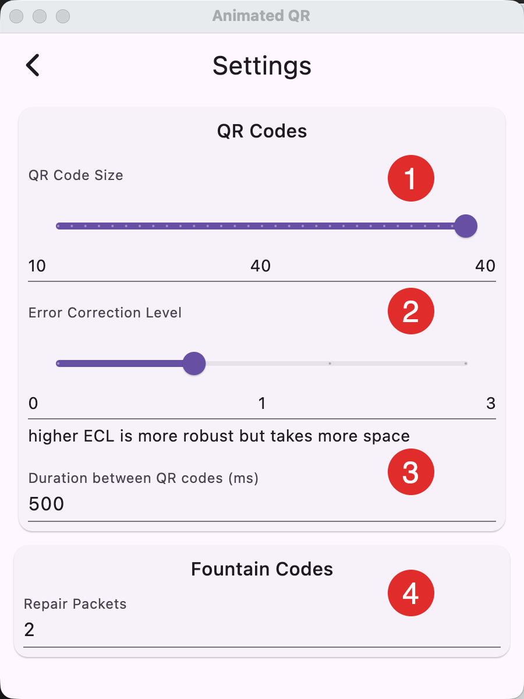

1. The size/version of the QR code. Lower versions are larger and easier to scan but also have less capacity. Try to find the size that fits your device screen, yet can still be recognized by the receiver.
2. The error correction level. QR codes offer four levels of error correction: Low (L), Medium (M), Quartile (Q), and High (H). These levels determine how much data can be recovered if the QR code is damaged or distorted. Higher levels of error correction provide more robust protection against damage but reduce the amount of data that can be stored in the QR code.
   1. Level L (0): 7% of data bytes can be restored.
   2. Level M (1): 15% of data bytes can be restored.
   3. Level Q (2): 25% of data bytes can be restored.
   4. Level H (3): 30% of data bytes can be restored.
3. How long each QR code will stay on the screen. Increase if your receiver has
   trouble scanning the QR code fast enough.
4. The number of extra QR codes (RaptorQ) for error correction inter QR codes. With a 2
   extra QR, 2 QR codes can be completely missed or misscanned and the data
   would still be recoverable.

> The reader will automatically stop scanning when enough data has been received.

::: tip
Choose the biggest type possible. Start with Medium Error Correction and a few extra
QR codes of RaptorQ. Having large QR codes helps the most. Lower the time
between images if your receiver is fast.
:::
